## 谁问你了？

[](https://git.io/typing-svg)



<!--START_SECTION:waka-->


**🐱 我的 GitHub 数据** 

> 📦  使用了 213.2 kB GitHub 存储空间 
 > 
> 🏆 67 个贡献，在 2026 年
 > 
> 🚫 不开放招聘
 > 
> 📜 24 个公共仓库 
 > 
> 🔑 9 个私人仓库 
 > 
**我是早鸟 🐤** 

```text
🌞 早晨                     35 commits          ████░░░░░░░░░░░░░░░░░░░░░   14.23 % 
🌆 白天                     125 commits         █████████████░░░░░░░░░░░░   50.81 % 
🌃 傍晚                     80 commits          ████████░░░░░░░░░░░░░░░░░   32.52 % 
🌙 晚上                     6 commits           █░░░░░░░░░░░░░░░░░░░░░░░░   02.44 % 
```
📅 **星期三 时的我最有干劲** 

```text
星期一                      21 commits          ██░░░░░░░░░░░░░░░░░░░░░░░   08.54 % 
星期二                      32 commits          ███░░░░░░░░░░░░░░░░░░░░░░   13.01 % 
星期三                      51 commits          █████░░░░░░░░░░░░░░░░░░░░   20.73 % 
星期四                      23 commits          ██░░░░░░░░░░░░░░░░░░░░░░░   09.35 % 
星期五                      31 commits          ███░░░░░░░░░░░░░░░░░░░░░░   12.60 % 
星期六                      45 commits          █████░░░░░░░░░░░░░░░░░░░░   18.29 % 
星期日                      43 commits          ████░░░░░░░░░░░░░░░░░░░░░   17.48 % 
```


📊 **本周消耗时间** 

```text
🕑︎ 时区: Asia/Shanghai

💬 编程语言: 
Python                   41 mins             ████████████████████████░   95.92 % 
Markdown                 1 min               █░░░░░░░░░░░░░░░░░░░░░░░░   04.08 % 

🔥 编辑器: 
VS Code                  42 mins             █████████████████████████   100.00 % 

💻 操作系统: 
Windows                  42 mins             █████████████████████████   100.00 % 
```

**我最常使用 Python** 

```text
Python                   17 repos            ██████████░░░░░░░░░░░░░░░   41.46 % 
C#                       9 repos             █████░░░░░░░░░░░░░░░░░░░░   21.95 % 
HTML                     3 repos             ██░░░░░░░░░░░░░░░░░░░░░░░   07.32 % 
JavaScript               2 repos             █░░░░░░░░░░░░░░░░░░░░░░░░   04.88 % 
Inno Setup               1 repo              █░░░░░░░░░░░░░░░░░░░░░░░░   02.44 % 
```


**时间线**


 Last Updated on 28/02/2026 18:57:17 UTC
<!--END_SECTION:waka-->
