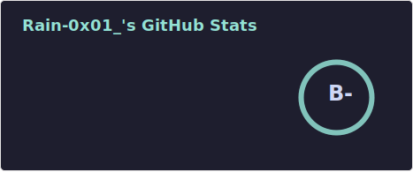

## 谁问你了？

[](https://git.io/typing-svg)



<!--START_SECTION:waka-->


**🐱 我的 GitHub 数据** 

> 📦  使用了 213.4 kB GitHub 存储空间 
 > 
> 🏆 96 个贡献，在 2026 年
 > 
> 🚫 不开放招聘
 > 
> 📜 27 个公共仓库 
 > 
> 🔑 9 个私人仓库 
 > 
**我是早鸟 🐤** 

```text
🌞 早晨                     36 commits          ███░░░░░░░░░░░░░░░░░░░░░░   11.15 % 
🌆 白天                     130 commits         ██████████░░░░░░░░░░░░░░░   40.25 % 
🌃 傍晚                     150 commits         ████████████░░░░░░░░░░░░░   46.44 % 
🌙 晚上                     7 commits           █░░░░░░░░░░░░░░░░░░░░░░░░   02.17 % 
```
📅 **星期六 时的我最有干劲** 

```text
星期一                      25 commits          ██░░░░░░░░░░░░░░░░░░░░░░░   07.74 % 
星期二                      54 commits          ████░░░░░░░░░░░░░░░░░░░░░   16.72 % 
星期三                      52 commits          ████░░░░░░░░░░░░░░░░░░░░░   16.10 % 
星期四                      23 commits          ██░░░░░░░░░░░░░░░░░░░░░░░   07.12 % 
星期五                      31 commits          ██░░░░░░░░░░░░░░░░░░░░░░░   09.60 % 
星期六                      94 commits          ███████░░░░░░░░░░░░░░░░░░   29.10 % 
星期日                      44 commits          ███░░░░░░░░░░░░░░░░░░░░░░   13.62 % 
```


📊 **本周消耗时间** 

```text
🕑︎ 时区: Asia/Shanghai

💬 编程语言: 
本周没有记录到任何活动

🔥 编辑器: 
本周没有记录到任何活动

💻 操作系统: 
本周没有记录到任何活动
```

**我最常使用 Python** 

```text
Python                   20 repos            ███████████░░░░░░░░░░░░░░   44.44 % 
C#                       9 repos             █████░░░░░░░░░░░░░░░░░░░░   20.00 % 
JavaScript               3 repos             ██░░░░░░░░░░░░░░░░░░░░░░░   06.67 % 
HTML                     3 repos             ██░░░░░░░░░░░░░░░░░░░░░░░   06.67 % 
Inno Setup               1 repo              █░░░░░░░░░░░░░░░░░░░░░░░░   02.22 % 
```


**时间线**


 Last Updated on 03/05/2026 19:35:31 UTC
<!--END_SECTION:waka-->
