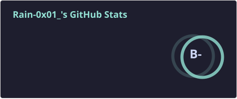

## 谁问你了？

[](https://git.io/typing-svg)



<!--START_SECTION:waka-->


**🐱 我的 GitHub 数据** 

> 📦  使用了 214.3 kB GitHub 存储空间 
 > 
> 🏆 172 个贡献，在 2026 年
 > 
> 🚫 不开放招聘
 > 
> 📜 34 个公共仓库 
 > 
> 🔑 8 个私人仓库 
 > 
**我是夜猫 🦉** 

```text
🌞 早晨                     41 commits          ██░░░░░░░░░░░░░░░░░░░░░░░   07.68 % 
🌆 白天                     180 commits         ████████░░░░░░░░░░░░░░░░░   33.71 % 
🌃 傍晚                     305 commits         ██████████████░░░░░░░░░░░   57.12 % 
🌙 晚上                     8 commits           ░░░░░░░░░░░░░░░░░░░░░░░░░   01.50 % 
```
📅 **星期日 时的我最有干劲** 

```text
星期一                      35 commits          ██░░░░░░░░░░░░░░░░░░░░░░░   06.55 % 
星期二                      115 commits         █████░░░░░░░░░░░░░░░░░░░░   21.54 % 
星期三                      54 commits          ███░░░░░░░░░░░░░░░░░░░░░░   10.11 % 
星期四                      26 commits          █░░░░░░░░░░░░░░░░░░░░░░░░   04.87 % 
星期五                      34 commits          ██░░░░░░░░░░░░░░░░░░░░░░░   06.37 % 
星期六                      129 commits         ██████░░░░░░░░░░░░░░░░░░░   24.16 % 
星期日                      141 commits         ███████░░░░░░░░░░░░░░░░░░   26.40 % 
```


📊 **本周消耗时间** 

```text
🕑︎ 时区: Asia/Shanghai

💬 编程语言: 
Python                   4 hrs 26 mins       ███████████████░░░░░░░░░░   58.83 % 
JSON                     42 mins             ██░░░░░░░░░░░░░░░░░░░░░░░   09.46 % 
Other                    39 mins             ██░░░░░░░░░░░░░░░░░░░░░░░   08.62 % 
TypeScript               23 mins             █░░░░░░░░░░░░░░░░░░░░░░░░   05.18 % 
YAML                     17 mins             █░░░░░░░░░░░░░░░░░░░░░░░░   03.79 % 

🔥 编辑器: 
VS Code                  5 hrs 5 mins        █████████████████░░░░░░░░   67.44 % 
OpenCode                 2 hrs 27 mins       ████████░░░░░░░░░░░░░░░░░   32.56 % 

💻 操作系统: 
Windows                  7 hrs 32 mins       █████████████████████████   100.00 % 
```

🤖 **AI Coding This Week** 

```text
⏱ AI Coding Time: 3 hrs 55 mins (52.01%)

✍️ 434 lines written by AI, 61 lines written by hand (87.68% AI-written)

🔤 5,793,951 Input Tokens, 110,279 Output Tokens

💵 $98.71 Estimated AI Cost This Week

🧠 20 AI Sessions, 82 AI Prompts

Deepseek                 266 lines           ███████████████████░░░░░░   74.93 % 
Glm                      73 lines            █████░░░░░░░░░░░░░░░░░░░░   20.56 % 
Opencode-Cli             16 lines            █░░░░░░░░░░░░░░░░░░░░░░░░   04.51 % 
Mimo                     0 lines             ░░░░░░░░░░░░░░░░░░░░░░░░░   00.00 % 
K                        0 lines             ░░░░░░░░░░░░░░░░░░░░░░░░░   00.00 % 

🔎 AI Coding Insights:
🤖 AI-Driven — 87.68% of written lines came from AI
📚 Verbose Prompter — average 4,701 characters per prompt
🔁 Iterative Prompter — average 4 prompts per session
🚀 High AI Trust — 12.99% of changed lines were hand-edited
```

**我最常使用 Python** 

```text
Python                   28 repos            ████████████░░░░░░░░░░░░░   50.00 % 
C#                       8 repos             ████░░░░░░░░░░░░░░░░░░░░░   14.29 % 
JavaScript               3 repos             █░░░░░░░░░░░░░░░░░░░░░░░░   05.36 % 
HTML                     3 repos             █░░░░░░░░░░░░░░░░░░░░░░░░   05.36 % 
Inno Setup               1 repo              ░░░░░░░░░░░░░░░░░░░░░░░░░   01.79 % 
```


**时间线**


 Last Updated on 29/08/2026 21:07:02 UTC
<!--END_SECTION:waka-->
