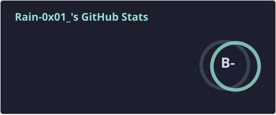

## 谁问你了？

[](https://git.io/typing-svg)



<!--START_SECTION:waka-->


**🐱 我的 GitHub 数据** 

> 📦  使用了 214.7 kB GitHub 存储空间 
 > 
> 🏆 182 个贡献，在 2026 年
 > 
> 🚫 不开放招聘
 > 
> 📜 34 个公共仓库 
 > 
> 🔑 8 个私人仓库 
 > 
**我是夜猫 🦉** 

```text
🌞 早晨                     76 commits          ███░░░░░░░░░░░░░░░░░░░░░░   10.34 % 
🌆 白天                     246 commits         ████████░░░░░░░░░░░░░░░░░   33.47 % 
🌃 傍晚                     404 commits         ██████████████░░░░░░░░░░░   54.97 % 
🌙 晚上                     9 commits           ░░░░░░░░░░░░░░░░░░░░░░░░░   01.22 % 
```
📅 **星期日 时的我最有干劲** 

```text
星期一                      70 commits          ██░░░░░░░░░░░░░░░░░░░░░░░   09.52 % 
星期二                      148 commits         █████░░░░░░░░░░░░░░░░░░░░   20.14 % 
星期三                      55 commits          ██░░░░░░░░░░░░░░░░░░░░░░░   07.48 % 
星期四                      26 commits          █░░░░░░░░░░░░░░░░░░░░░░░░   03.54 % 
星期五                      34 commits          █░░░░░░░░░░░░░░░░░░░░░░░░   04.63 % 
星期六                      163 commits         ██████░░░░░░░░░░░░░░░░░░░   22.18 % 
星期日                      239 commits         ████████░░░░░░░░░░░░░░░░░   32.52 % 
```


📊 **本周消耗时间** 

```text
🕑︎ 时区: Asia/Shanghai

💬 编程语言: 
Python                   1 hr 46 mins        ██████████████████████░░░   86.09 % 
Markdown                 7 mins              █░░░░░░░░░░░░░░░░░░░░░░░░   05.85 % 
Vue                      6 mins              █░░░░░░░░░░░░░░░░░░░░░░░░   05.32 % 
YAML                     3 mins              █░░░░░░░░░░░░░░░░░░░░░░░░   02.74 % 
Other                    0 secs              ░░░░░░░░░░░░░░░░░░░░░░░░░   00.00 % 

🔥 编辑器: 
OpenCode                 2 hrs 4 mins        █████████████████████████   100.00 % 

💻 操作系统: 
Windows                  2 hrs 4 mins        █████████████████████████   100.00 % 
```

🤖 **AI Coding This Week** 

```text
⏱ AI Coding Time: 2 hrs 4 mins (100.0%)

✍️ 72 lines written by AI, 0 lines written by hand (100.0% AI-written)

🔤 7,246,739 Input Tokens, 131,957 Output Tokens

💵 $40.62 Estimated AI Cost This Week

🧠 7 AI Sessions, 25 AI Prompts

Deepseek                 72 lines            █████████████████████████   100.00 % 
Mimo                     0 lines             ░░░░░░░░░░░░░░░░░░░░░░░░░   00.00 % 

🔎 AI Coding Insights:
🤖 AI-Driven — 100.0% of written lines came from AI
📝 Concise Prompter — average 486 characters per prompt
🔁 Iterative Prompter — average 4 prompts per session
🚀 High AI Trust — 0.0% of changed lines were hand-edited
```

**我最常使用 Python** 

```text
Python                   28 repos            ████████████░░░░░░░░░░░░░   50.00 % 
C#                       8 repos             ████░░░░░░░░░░░░░░░░░░░░░   14.29 % 
JavaScript               3 repos             █░░░░░░░░░░░░░░░░░░░░░░░░   05.36 % 
HTML                     3 repos             █░░░░░░░░░░░░░░░░░░░░░░░░   05.36 % 
Inno Setup               1 repo              ░░░░░░░░░░░░░░░░░░░░░░░░░   01.79 % 
```


**时间线**


 Last Updated on 02/10/2026 22:31:04 UTC
<!--END_SECTION:waka-->
